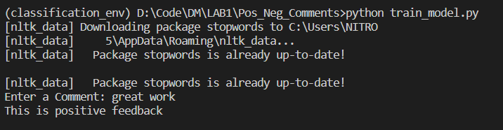

# POSITIVE NEGATIVE REVIEWS CLASSIFIER

## Uses Naive Bayes Classifier

This repo is the implementaion of multinominal naive bayes for classifying reviews.

## About scripts

- [x] generate_dataset.py to read the pdf files in local storage and generate a dataset ready to train multinominal naive bayes

- [x] train.py to train multinominal navie bayes model from sklearn

- [x] classifier.py to classify the given comment in terminal

### Output can be seen here

## Prepared as assignment of Data Mining Practical taught by [Siddhant Sharma](https://github.com/Siddhant128-bit)